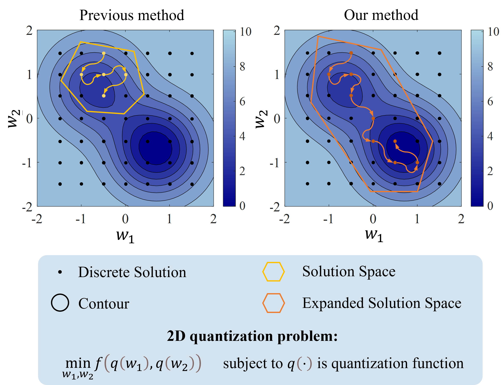
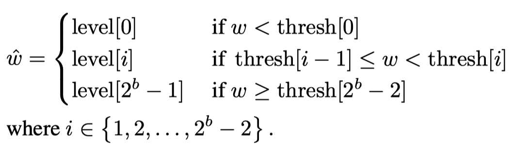
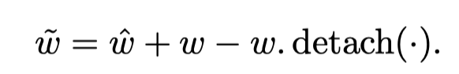
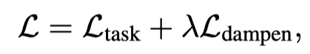
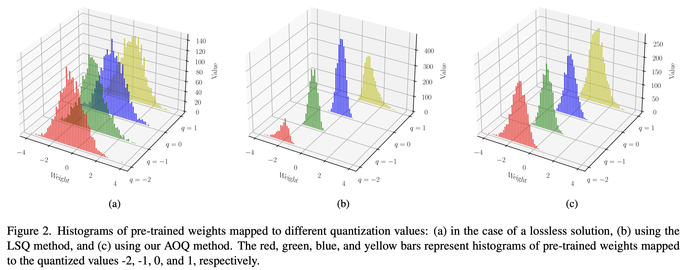

# Allowing Oscillation Quantization: Overcoming Solution Space Limitation in Low Bit-Width Quantization

This repository containes the code of AOQ introduced in our work: "[Allowing Oscillation Quantization: Overcoming Solution Space Limitation in Low Bit-Width Quantization]()"

In this work, we found that

1. In traditional quantization-aware training (QAT) methods, weights infrequently cross quantization thresholds during training. This restricts the model to searching for quantized solutions only within a local region, making it prone to sub-optimal solutions.
2. Moderate oscillations can actually serve as an effective exploration mechanism. By encouraging such oscillations in the early training phase, the model can escape local optima and explore better quantization configurations.
3. By decoupling quantization thresholds and levels, the learnable quantization parameters exhibit greater stability during training.

<div align="center">
    
</div>

## Training Pipeline
- For weight quantization, we define the intervals between quantization thresholds as $s_{th}$ and between quantization levels as $s_{le}$, both initialized to $\frac{\sigma_w}{2^{b-2}}$, where $\sigma_w$ is the standard deviation of weights in a layer, and $b$ is the quantization bit-width. In the first stage, we manually reduce $s_{th}$ and $s_{le}$ to appropriate values to encourage more weights to oscillate at the quantization thresholds.

- In the second stage, we fix $s_{th}$ and set $s_{le}$ as a learnable parameter for optimization. As $s_{le}$ increases during training, the intervals between quantization levels widen, making the cost of mapping errors from floating-point weights to quantized values higher, thereby gradually reducing oscillation. The quantizer is:

  <div align="center">
      
  </div>

  `thresh[i]` and `level[i]` represent the (i+1)-th threshold and level, respectively, in ascending numerical order.
  The optimized quantized weights are denoted as:

  <div align="center">
      
  </div>

- In the third stage, we employ the *Oscillation Dampening* method outlined in [Nagel et al., 2022]. This method adds a penalty term to the loss function:

  <div align="center">
      
  </div>

  where $\lambda$ is a hyperparameter. $\mathcal{L}_{\text{dampen}}$ pulls weights oscillating near the quantization thresholds away to suppress oscillation.


## Run


### 1. Requirements:
- python 3.9, pytorch>=2.0
- torchvision
- numpy
- timm=0.4.12
- pillow
- matplotlib

### 2. Run Command
```
bash run.sh architecture n_bits quantize_downsampling
```


## Toy Example

<div align="center">
    
</div>

### Run Command

```
bash run.sh
```